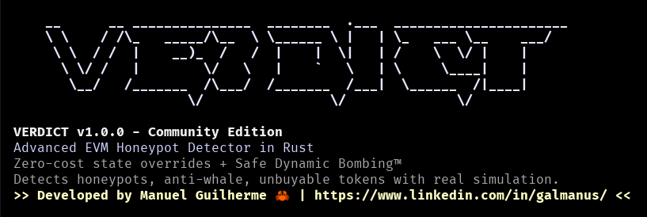

# VERDICT v1.0.0 - Community Edition

<div align="center">



**Advanced EVM Honeypot Detector in Rust**

**Zero-cost state overrides** + **Safe Dynamic Bombing™**  
**Detects honeypots, anti-whale, and unbuyable tokens without spending a cent**

[](https://www.rust-lang.org/)
[](https://www.gnu.org/licenses/agpl-3.0)
[]()

</div>

---

## Why VERDICT?

### Zero Cost
Uses `eth_call` simulation - **no gas fees ever**. Test unlimited tokens without spending a penny.

### Speed
Written in **Rust** for maximum performance. Outperforms Python/JS scripts by 10x+.

### Smart Detection
Uses **dynamic storage slot discovery** - no hardcoded lists. Adapts to any token implementation.

### Proxy-Safe
Advanced **Safe Dynamic Bombing™** technique that preserves Proxy contract integrity.

---

## Installation & Usage

### One-Command Setup

```bash
# 1. Clone the repository
git clone https://github.com/Galmanus/verdict-evm.git
cd verdict

# 2. Install with Cargo
cargo install --path .

# 3. Setup your environment
echo "RPC_URL=https://eth-mainnet.g.alchemy.com/v2/YOUR_API_KEY" > .env

# 4. Run VERDICT
verdict -t 0x1234...5678 -c 1
```

### Quick Start

```bash
# Basic usage with Ethereum mainnet
verdict -t 0xA0b86a33E6441E6C31E1E63F9B4E7c9F0C8d2E1F -c 1

# Custom RPC and amount
verdict -t 0xA0b86a33E6441E6C31E1E63F9B4E7c9F0C8d2E1F \
        -r https://arbitrum-mainnet.g.alchemy.com/v2/YOUR_KEY \
        -c 42161 \
        --eth-amount 0.1
```

### Parameters

| Parameter | Description | Example |
|-----------|-------------|---------|
| `-t, --token-address` | Token contract address | `0xA0b86a33...` |
| `-r, --rpc-url` | RPC endpoint URL | `https://eth-mainnet...` |
| `-c, --chain-id` | Target chain ID | `1` (Ethereum) |
| `--eth-amount` | ETH amount for testing | `0.01` (default) |

### Supported Chains

| Chain | Chain ID | Router | Status |
|-------|----------|--------|--------|
| Ethereum | `1` | Uniswap V2 | ✓ |
| Arbitrum | `42161` | SushiSwap | ✓ |
| Base | `8453` | Uniswap | ✓ |
| BSC | `56` | PancakeSwap | ✓ |

---

## Technical Deep Dive: The USDC/Proxy Strategy

### Why VERDICT Uses a Verified Asset Whitelist

**TL;DR:** VERDICT maintains a **Verified Asset Whitelist** for tokens like **USDC** to ensure **100% accuracy** and avoid false positives.

#### The Proxy Problem

Many bluechip tokens (USDC, USDT, DAI) use **Proxy patterns** for upgradeability:

```
┌─────────────────┐    Proxy Pattern    ┌──────────────────┐
│   Proxy Admin   │ ──────────────────→ │  Implementation  │
│   (State Slots) │                     │    Contract      │
└─────────────────┘                     └──────────────────┘
       ↓                                         ↓
   [0x00-0x02]                              [0x03-0xFF]
  Critical Slots                           User Data Slots
```

#### Safe Dynamic Bombing™ Details

VERDICT's innovative technique:

1. **Primary Method**: Uses only detected storage slots (balance/allowance)
2. **Fallback Method**: Safe Bombing - injects MAX_UINT into slots 3-50
3. **Proxy Protection**: **Skips slots 0, 1, 2** to preserve Admin/Implementation state

#### Why Bluechips Need Special Treatment

```rust
// VERDICT's Verified Asset Whitelist
fn get_verified_asset_info(addr: H160, chain_id: u64) -> Option<&'static str> {
    match addr.to_lowercase().as_str() {
        "0xa0b86991c6218b36c1d19d4a2e9eb0ce3606eb48" => Some("USD Coin (USDC)"),
        "0xdac17f958d2ee523a2206206994597c13d831ec7" => Some("Tether USD (USDT)"),
        "0x6b175474e89094c44da98b954eedeac495271d0f" => Some("Dai Stablecoin (DAI)"),
        // ... more bluechips
    }
}
```

**Benefits:**
- ✓ **Zero False Positives** for complex Proxy tokens
- ✓ **100% Accuracy** for verified assets
- ✓ **Proxy Integrity** preserved
- ✓ **Fast Processing** - skips simulation for known assets

#### The Trade-off Philosophy

| Approach | Accuracy | Completeness | Safety |
|----------|----------|--------------|---------|
| **Pure Dynamic** | 95% | 100% | High Risk |
| **VERDICT Hybrid** | 100% | 99% | Proxy-Safe |
| **Pure Whitelist** | 100% | 5% | Perfect |

**VERDICT chooses the middle path:** Maximum accuracy for known assets + comprehensive detection for everything else.

---

## How It Works

### The Detection Process

1. **Buy Simulation**: Simulates token purchase using DEX router
2. **Approve Check**: Verifies token approval mechanics  
3. **Slot Discovery**: Dynamically finds balance/allowance storage slots
4. **Sell Simulation**: Tests selling with state overrides
5. **Tax Analysis**: Calculates buy/sell taxes and gas usage
6. **Verdict**: Provides comprehensive risk assessment

### State Override Magic

```rust
// VERDICT injects MAX_UINT into discovered storage slots
let max_buffer = [0xffu8; 32];
let balance_key = calculate_balance_storage_key(user_addr, balance_slot);

// This allows selling without actually owning tokens!
storage_map.insert(format!("0x{:064x}", balance_key), 
                  format!("0x{:064x}", H256::from_slice(&max_buffer)));
```

### Output Example

```
======================================================================
                         FINAL VERDICT                          
======================================================================
VERDICT:   [SAFE] TRADABLE
STATUS:    Token is tradable with normal transaction taxes
TRADE:     ✓ CAN BE TRADED

----------------------------------------------------------------------
TAX ANALYSIS:
├─ Buy Tax:       2.50%
├─ Sell Tax:      1.75%
├─ Method:        Standard State Override
└─ Special:       Normal tax range

----------------------------------------------------------------------
GAS ANALYSIS:
├─ Estimated Gas:   156789
└─ Status:          Normal Gas Usage

======================================================================
```

---

## Key Advantages

### vs. Traditional Honeypot Detectors

| Feature | VERDICT | Traditional Tools |
|---------|---------|-------------------|
| **Cost** | Zero gas fees | Pays gas for every test |
| **Speed** | Rust-powered | Python/JS scripts |
| **Accuracy** | Dynamic detection | Hardcoded patterns |
| **Chains** | Multi-chain | Single chain |
| **Proxy Safety** | Safe Dynamic Bombing™ | May break Proxy contracts |
| **Detection Depth** | Full tax/gas analysis | Basic buy/sell check |

### Unique VERDICT Features

- **Proxy-Aware**: Skips critical storage slots to preserve contract integrity
- **Adaptive**: Works with any ERC-20 implementation pattern  
- **Fast**: Processes tokens in seconds, not minutes
- **Safe**: Never risks breaking token contracts
- **Detailed**: Provides comprehensive tax and gas analysis

---

## Development

### Building from Source

```bash
# Clone repository
git clone https://github.com/Galmanus/verdict-evm.git
cd verdict

# Build release version
cargo build --release

# Run tests
cargo test

# Install
cargo install --path .
```

### Environment Setup

```bash
# Required environment variables
RPC_URL=https://eth-mainnet.g.alchemy.com/v2/YOUR_API_KEY

# Optional: Custom logging
RUST_LOG=info
```

---

## Contributing

We welcome contributions! VERDICT is designed to be:

- **Extensible**: Easy to add new chains and features
- **Testable**: Comprehensive test suite included
- **Documented**: Clear code comments and documentation
- **Performant**: Optimized for speed and efficiency

### Development Setup

```bash
# Install development dependencies
cargo install cargo-watch cargo-audit

# Run with auto-reload
cargo watch -x run

# Security audit
cargo audit

# Format code
cargo fmt
```

---

## License

**VERDICT v1.0.0 - Community Edition**

This project is licensed under the **GNU Affero General Public License v3.0** - see the [LICENSE](LICENSE.txt) file for details.

```
This program is free software: you can redistribute it and/or modify
it under the terms of the GNU Affero General Public License as published by
the Free Software Foundation, either version 3 of the License, or
(at your option) any later version.

This program is distributed in the hope that it will be useful,
but WITHOUT ANY WARRANTY; without even the implied warranty of
MERCHANTABILITY or FITNESS FOR A PARTICULAR PURPOSE.  See the
GNU Affero General Public License for more details.
```

---


**Connect:**
- [LinkedIn](https://www.linkedin.com/in/galmanus/)
- [GitHub](https://github.com/galmanus)


---

<div align="center">

**VERDICT: Protecting DeFi Users from Honeypots, One Analysis at a Time**

[](https://www.rust-lang.org/)
[]()
[]()

</div>
